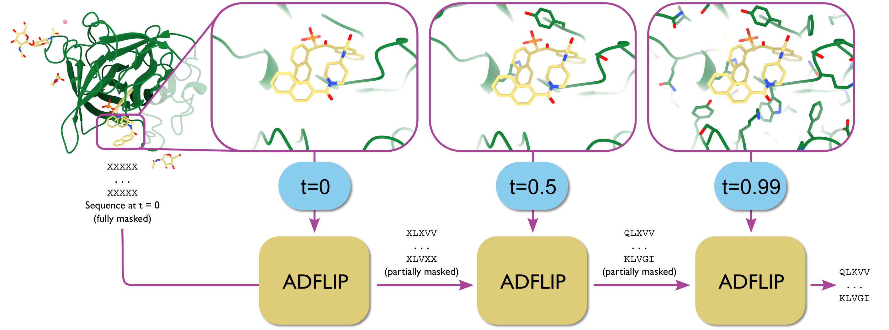

# ADFLIP: All-atom inverse protein folding through discrete flow matching (ICML2025)

## Description
Implementation for "All-atom inverse protein folding through discrete flow matching" [Link](https://openreview.net/forum?id=8tQdwSCJmA).

## Environment Setup

```bash
conda create -n ADFLIP python=3.10 pip -y
conda activate ADFLIP
pip install -r requirements.txt
pip install torch-cluster -f https://data.pyg.org/whl/torch-2.1.0+cu121.html
pip install torch-scatter -f https://data.pyg.org/whl/torch-2.1.0+cu121.html
pip install hydra-core
```


## Usage

There are two main ways to sample sequences from a given input file:

1. **Fixed-step sampling** using a constant time step (`dt`):

   ```python

   # Fixed-step sampling
   samples, logits = flow_model.sample(
       input_file,
       dt=0.2
   )
   ```

2. **Adaptive-step sampling** based on model uncertainty (up to `num_step`, stops when confidence > `threshold`):

   ```python
   # Adaptive sampling
   samples, logits = flow_model.adaptive_sample(
       input_file,
       num_step=8,
       threshold=0.9
   )
   ```
The entire workflow for using ADFLIP can be found the [file](test/design.py). It loads a checkpoint, processes a PDB file, runs sampling, and computes recovery rates:

## Comments 

- Our codebase for discrete flow matching builds on [Discrete Flow Models](https://github.com/andrew-cr/discrete_flow_models).
Thanks for open-sourcing!

## Citation 
If you consider our codes and datasets useful, please cite:
```
@inproceedings{
      yi2025allatom,
      title={All-atom inverse protein folding through discrete flow matching},
      author={Kai Yi and Kiarash Jamali and Sjors HW Scheres},
      booktitle={Forty-second International Conference on Machine Learning},
      year={2025},
      url={https://openreview.net/forum?id=8tQdwSCJmA}
      }
```
